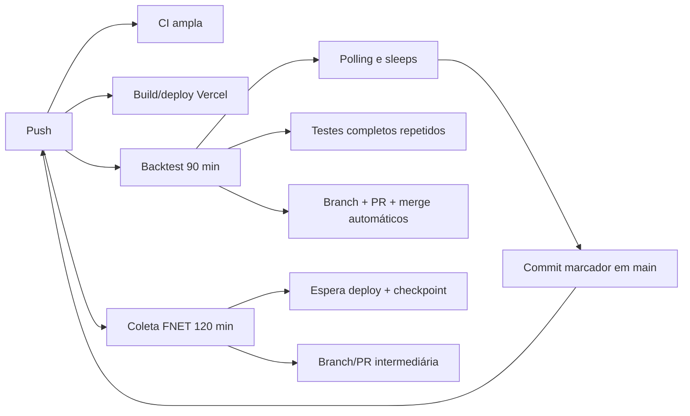
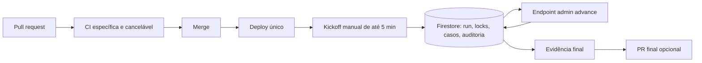

# Inventário e orçamento do GitHub Actions

**Baseline auditado:** `main` em `fb926f241a57a3d1c0f1a701f82701f302fece1a`  
**Branch de otimização:** `agent/github-actions-cost-architecture`  
**Método:** comparação completa do commit inicial com o baseline, leitura integral dos sete workflows ativos e auditoria das PRs temporárias da Sprint 3.5.

## 1. Resumo executivo

| Métrica | Antes | Depois desta branch |
|---|---:|---:|
| Workflows ativos no `main` | 7 | 5 |
| Workflows removidos | 0 | 2 |
| Workflows com escrita no repositório | 3 | 0 |
| Workflows pesados automáticos por `push` | 2 | 0 |
| Workflows com polling/sleep | 2 | 0 |
| Workflows com timeout acima de 30 min | 2 | 0 |
| Workflows com `npm install` | 4 | 0 |
| Workflows sem `concurrency` cancelável | 2 | 0 |
| Artefatos com retenção acima de 7 dias | 3 | 0 |
| Estado operacional salvo em marcador Git | 1 | 0 |

Classificação das mudanças:

- **removidos:** 2;
- **processamento migrado para backend/Firestore:** 1 fluxo principal de backtest;
- **tornados exclusivamente manuais:** 2 fluxos pesados;
- **otimizados:** 3 workflows de CI;
- **suítes essenciais removidas:** 0.

## 2. Inventário anterior completo

| Workflow | Finalidade anterior | Eventos/filtros | Timeout/jobs | Dependências/cache | Artefatos/retenção | Sleep/retry/escrita | Frequência projetada | Classificação anterior |
|---|---|---|---|---|---|---|---:|---|
| `patch-portfolio-notification-types.yml` | Patch pontual de TypeScript | `push` em `feature/portfolio-notifications`, apenas o próprio YAML | sem timeout; 1 job | nenhuma | nenhum | alterava código, removia a si próprio, commit e push na branch | ~0/mês | **LEGADO OU SEM USO** |
| `phase-2-closure.yml` | Encerramento/regressão da Fase 2 | `pull_request` e `push main` para quase todo `src/**` e `tests/**` | 30 min; 1 job | `npm install`; cache npm | nenhum | repetia typecheck, Sprint 2 e Risk Lab | ~60/mês no cenário | **ÚTIL, MAS PODE SER OTIMIZADO** |
| `portfolio-notifications-ci.yml` | Typecheck de notificações | todo PR para `main` e manual; sem `paths` | 15 min; 1 job | `npm install`; cache npm | nenhum | duplicava typecheck da CI geral; sem concurrency | ~30/mês | **ÚTIL, MAS PODE SER OTIMIZADO** |
| `risk-lab.yml` | CI do Risk Lab | PR e push `main`, inclusive documentação/evidência | 10 min; 1 job | `npm install`; cache npm | logs, 14 dias | repetia typecheck e gerava artefato em toda execução | ~16/mês no cenário | **ESSENCIAL NO GITHUB ACTIONS**, mas superdimensionado |
| `risk-lab-cohort-backtest.yml` | Backtest de Produção e publicação de evidência | `push main` em área ampla, inclusive marcador, e manual | 90 min; 1 job | instalava dependências novamente quando aprovado | evidência, 30 dias | até 12 inicializações com sleep; 6 fundos sequenciais; sleep de 430 s; testes completos; branch, PR e merge automáticos | até 6 execuções/release | **DEVE SER MOVIDO PARA OUTRA CAMADA** |
| `risk-lab-cohort-deploy-recovery.yml` | Recuperar deploy/backtest | manual no baseline, anteriormente periódico | 10 min; 1 job | nenhuma | nenhum | alterava marcador, commitava em `main`, fazia push e acionava outro workflow; até 6 tentativas | até 6/release | **TEMPORÁRIO E DEVE SER REMOVIDO** |
| `risk-lab-frozen-dividend-notices.yml` | Coleta FNET congelada | `push main` em arquivos do Risk Lab e manual | 120 min; 1 job | `npm install`; cache npm | checkpoint/evidência, 30 dias | até 20 esperas de deploy; coleta sequencial; testes completos; branch e PR em tentativa | ~1/mês | **DEVE SER MOVIDO PARA OUTRA CAMADA** |

### Workflows temporários fora do `main`

| Origem | Arquivos | Situação |
|---|---|---|
| PR #96 | `sprint-3-5-batched-resume-fix.yml`, `sprint-3-5-batched-resume-fix-v2.yml` | retomadas automáticas de até 12 lotes; não devem ser mescladas |
| PR #100 | `risk-lab-deva11-phase-a.yml` | workflow temporário de evidência; deve ser removido da branch antes de eventual merge |

## 3. Inventário posterior

| Workflow | Finalidade oficial | Novos gatilhos | Timeout | Instalação/testes | Escrita/artefato | Classificação final | Orçamento mensal |
|---|---|---|---:|---|---|---|---:|
| `phase-2-closure.yml` | CI central rápida; nome preservado por compatibilidade de status check | PR de código/configuração; push `main` somente para governança/configuração | 20 min | `npm ci`; governança; typecheck e Sprint 2 apenas no PR | somente leitura; sem artefato | **ESSENCIAL NO GITHUB ACTIONS** | 420 min |
| `portfolio-notifications-ci.yml` | Regressões específicas de notificações | PR apenas quando o domínio muda; manual | 8 min | `npm ci`; 2 testes específicos; sem typecheck duplicado | somente leitura | **ESSENCIAL NO GITHUB ACTIONS** | 18 min |
| `risk-lab.yml` | Suíte especializada do Risk Lab | PR apenas para código/testes do domínio; manual | 15 min | `npm ci`; somente `test:risk-lab` | somente leitura; logs nativos | **ESSENCIAL NO GITHUB ACTIONS** | 64 min |
| `risk-lab-cohort-backtest.yml` | Kickoff de tentativa vinculada a SHA | somente `workflow_dispatch` com SHA explícito | 5 min | sem checkout, sem Node, sem instalação; 1 chamada HTTP | resposta curta, 3 dias | **ÚTIL, PROCESSAMENTO MOVIDO AO BACKEND** | 2 min |
| `risk-lab-frozen-dividend-notices.yml` | Exceção manual temporária do coletor | somente `workflow_dispatch` com SHA explícito | 30 min | `npm ci`; coleta/checkpoint; sem suítes completas | somente artefato de 3 dias; sem Git/PR | **TEMPORÁRIO, MANUAL E LIMITADO** | 25 min |

## 4. Fluxo anterior

## 5. Fluxo posterior

O Actions não acompanha locks, não espera o deploy, não executa os seis fundos e não armazena progresso em commits.

## 6. Projeção mensal antes e depois

A projeção não substitui a fatura do GitHub. É um cenário reproduzível para comparar arquiteturas:

- 30 PRs de código e 30 merges em `main` por mês;
- 8 PRs com alterações do Risk Lab;
- 6 PRs com alterações de notificações;
- 1 release elegível da Sprint 3.5;
- cadeia anterior de até 6 tentativas do backtest;
- 1 coleta FNET mensal.

### Antes

| Workflow | Fórmula | Minutos |
|---|---:|---:|
| Phase 2 Closure | 60 execuções × 20 min médios | 1.200 |
| Portfolio Notifications | 30 × 3 min | 90 |
| Risk Lab CI | 16 × 10 min | 160 |
| Production Backtest | 6 × 90 min máximos | 540 |
| Deployment Recovery | 6 × 5 min médios | 30 |
| Frozen Dividend Notices | 1 × 120 min | 120 |
| Patch legado | sem uso esperado | 0 |
| **Total projetado** |  | **2.140 min/mês** |

### Depois

| Workflow | Fórmula | Minutos |
|---|---:|---:|
| CI central | 30 PRs × 12 min + 30 pós-merge × 2 min | 420 |
| Portfolio Notifications | 6 × 3 min | 18 |
| Risk Lab CI | 8 × 8 min | 64 |
| Backtest Kickoff | 1 × 2 min | 2 |
| Coleta FNET manual | 1 × 25 min médios | 25 |
| **Total projetado** |  | **529 min/mês** |

**Redução projetada:** `1.611 min/mês`, ou **75,3%**.

Quando a coleta FNET também migrar para fila/worker, a projeção cai para aproximadamente **504 min/mês**, redução de **76,4%** sobre o baseline.

## 7. Alterações de gatilho e timeout

| Workflow | Gatilho anterior | Gatilho novo | Timeout anterior | Timeout novo |
|---|---|---|---:|---:|
| Patch legado | push em branch antiga | removido | ausente | n/a |
| Phase 2 Closure | PR + todo push relevante em main | PR amplo + pós-merge apenas de configuração/governança | 30 | 20 |
| Portfolio Notifications | todo PR | PR do domínio | 15 | 8 |
| Risk Lab CI | PR + push, inclusive docs/evidência | PR do domínio + manual | 10 | 15, sem typecheck duplicado |
| Production Backtest | push amplo + manual | manual com SHA explícito | 90 | 5 |
| Deployment Recovery | manual/periódico e commit em main | removido | 10 | n/a |
| Frozen Dividend Notices | push amplo + manual | manual com SHA explícito | 120 | 30 |

## 8. Retries e estado

| Tema | Antes | Depois |
|---|---|---|
| Deploy não pronto | 12 ou 20 tentativas com sleep | falha imediata; nova execução explícita depois do deploy |
| Lock de fundo | sleep de ~430 s no runner | lock e recuperação no Firestore/backend |
| Retry de release | commit marcador e novo push | mesma tentativa/mesmo SHA no banco |
| Progresso | artifacts + marcador Git | `RiskLabCohortBacktestRuns`, attempts, audit e locks |
| Evidência intermediária | branch/PR por tentativa | logs, summary, Firestore e artefato de 3 dias |

## 9. Criticidade e alternativas

- CI central, Risk Lab e notificações: permanecem no GitHub porque produzem status checks ligados ao código.
- Backtest: o GitHub só inicia a tentativa; casos e locks já pertencem ao backend/Firestore.
- Coleta FNET: permanece como exceção manual limitada; solução definitiva é fila persistente e worker da aplicação.
- Cron de negócio: deve permanecer no `vercel.json`/backend, nunca em `.github/workflows`.

## 10. Limitações conhecidas e dívida técnica

1. A frequência definitiva do worker FNET depende da confirmação dos limites/custo do plano Vercel; não foi criado cron agressivo por precaução.
2. Até existir scheduler, o endpoint administrativo `advance` executa uma etapa idempotente por chamada e escolhe automaticamente inicialização, próximo fundo ou finalização.
3. O nome `Phase 2 Closure CI` foi preservado temporariamente para reduzir risco de quebrar proteção de branch; sua função agora é CI central.
4. Falhas históricas de runner antes de qualquer step não são atribuídas ao código; devem ser diferenciadas de falha de teste.
5. A estimativa mensal deve ser recalibrada com dados reais de uso após 30 dias.

## 11. Controle de recorrência

`tests/github-actions-governance.test.mjs` impede:

- workflow não inventariado;
- retorno dos arquivos legados;
- commit/push/PR/merge automáticos;
- `gh workflow run` como retry;
- marcador da Sprint 3.5;
- sleep, polling ou retry ilimitado;
- timeout acima do orçamento;
- `npm install`;
- falta de cache/concurrency;
- schedule de aplicação;
- permissão de escrita;
- gatilho automático nos workflows pesados;
- retenção de artefato acima de 7 dias.
