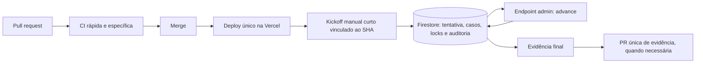

# Política oficial de uso do GitHub Actions

**Status:** obrigatória  
**Escopo:** todos os arquivos em `.github/workflows/`  
**Responsável técnico:** engenharia do Dados FII  
**Validação automática:** `npm run test:workflow-governance`

## 1. Princípio arquitetural

GitHub Actions é uma camada de engenharia ligada ao ciclo de vida do código. Não é scheduler de aplicação, fila, banco operacional, mecanismo de retry ou monitor de Produção.

Um workflow só permanece no GitHub quando precisa de pelo menos uma destas características:

- reagir a pull request ou alteração de código;
- validar código antes do merge;
- usar o contexto Git e o SHA da alteração;
- publicar um status check obrigatório;
- auditar migration, schema, release ou artefato de engenharia ligado ao código;
- iniciar uma operação curta cujo resultado operacional continue fora do runner.

## 2. Usos permitidos

- typecheck, lint quando o comando estiver funcional e estável;
- testes unitários, integração ligada ao código e regressões arquiteturais;
- integridade de schemas, contratos e datasets versionados;
- build de verificação condicionado a arquivos relevantes;
- auditoria curta de release vinculada a SHA;
- `workflow_dispatch` para iniciar uma execução persistida no backend;
- artefatos diagnósticos curtos, sem servirem como estado primário da aplicação.

## 3. Usos proibidos

- esperar deployment por vários minutos;
- polling, loops de `curl`, sleeps ou backoff dentro do runner;
- cron de negócio, coleta periódica ou monitoramento contínuo;
- processar fundos sequencialmente por longos períodos;
- manter checkpoint operacional apenas em artefato ou arquivo Git;
- criar commit, fazer push em `main` ou alterar marcador para provocar outro evento;
- iniciar outro workflow como retry;
- repetir suítes completas já aprovadas para o mesmo SHA;
- criar branch ou PR em tentativa intermediária;
- conceder `contents: write`, `actions: write` ou `pull-requests: write` sem exceção formal e temporária.

## 4. Camadas substitutas

| Necessidade | Camada preferencial |
|---|---|
| Rotina diária/mensal | Vercel Cron ou scheduler da infraestrutura |
| Estado, lock, progresso e retry | Firestore/banco da aplicação |
| Processamento segmentado | serviço interno e endpoint administrativo protegido |
| Fila de documentos/fundos | coleção persistida no Firestore |
| Monitor de Produção | observabilidade/backend, não runner |
| Espera por deploy | webhook/evento de deploy ou execução posterior explícita |
| Reprocessamento operacional | comando administrativo idempotente |
| Evidência final relevante | arquivo versionado e PR única, somente após conclusão |

## 5. Regras obrigatórias de workflow

### Gatilhos

- CI de código: `pull_request` para `main`.
- `push`: somente em `main` e apenas para validação pós-merge curta.
- QA funcional pode usar os dois schedules exclusivos de `functional-qa.yml`: smoke diário curto e suíte completa semanal, ambos vinculados ao SHA de `main`, sem função de negócio.
- Workflows pesados: somente `workflow_dispatch` ou evento único formalmente documentado.
- Alterações exclusivamente documentais não executam suítes de código, salvo documentos que sejam contratos validados.
- Um mesmo domínio não repete a mesma suíte em workflows diferentes no mesmo SHA.

### Concorrência

Todo workflow deve declarar:

```yaml
concurrency:
  group: <workflow>-<ref-ou-release>
  cancel-in-progress: true
```

### Dependências

- usar `package-lock.json` e `npm ci`;
- usar `actions/setup-node` com `cache: npm`;
- nunca usar `npm install` em CI;
- instalar dependências no máximo uma vez por job.

### Timeout

- CI comum: até 20 minutos por job;
- workflow pesado temporário e manual: até 30 minutos, com comentário `governance-exception` e dívida registrada;
- timeouts maiores são proibidos;
- toda etapa HTTP deve possuir timeout próprio menor que o timeout do job.

### Artefatos

- diagnóstico operacional: 1 a 3 dias;
- CI excepcional: até 7 dias;
- evidência regulatória/metodológica final: versionada no Git ou retenção de 30 dias somente mediante exceção explícita;
- não gerar artefato vazio ou duplicar conteúdo disponível nos logs.

### Segurança

- permissões mínimas, normalmente `contents: read`;
- segredos nunca aparecem em query string, log ou artefato;
- endpoints operacionais usam autenticação administrativa ou segredo de infraestrutura;
- workflows não fazem merge automático de evidência metodológica.

## 6. Fluxo oficial da Sprint 3.5



Regras:

1. Uma release pode receber no máximo um kickoff ativo por SHA.
2. O kickoff faz uma única chamada e encerra; não acompanha o processamento.
3. O backend escolhe automaticamente `initialize`, próximo ticker ou `finalize` por meio da ação `advance`.
4. Locks, tentativas, casos e auditoria ficam no Firestore.
5. Retry operacional reutiliza o mesmo `runId` e SHA; não cria commit.
6. A evidência intermediária permanece no banco, logs ou artefato curto.
7. Branch/PR só é criada para evidência final estável e relevante.

## 7. Exceções vigentes

### QA funcional recorrente

`functional-qa.yml` possui uma exceção permanente e estrita à proibição geral de cron. Ela existe para testar a aplicação publicada como usuário real, e não para executar trabalho da aplicação.

Restrições:

- somente dois schedules: smoke diário curto e suíte completa semanal;
- usuário Firebase exclusivo, verificado, sem privilégios administrativos;
- escrita limitada aos dados artificiais desse usuário, com cleanup idempotente;
- `workers=1` e um único retry apenas na CI;
- nenhum polling, `sleep`, fila, coleta ou processamento operacional;
- evidências somente em falha, redigidas e retidas por até sete dias;
- revisão de custo mensal no inventário.

### Coleta FNET temporária

`risk-lab-frozen-dividend-notices.yml` permanece manual por depender do coletor de engenharia e de checkpoint associado ao SHA.

Restrições enquanto existir:

- sem `push`, cron ou pull request automático;
- sem espera por deploy;
- sem commits, branches ou PRs;
- timeout máximo de 30 minutos;
- checkpoint/diagnóstico com retenção de 3 dias;
- nenhuma repetição das suítes completas de CI.

**Solução definitiva:** mover a coleta para fila persistida no Firestore e worker/scheduler da aplicação. A frequência do scheduler só será definida depois de confirmar limites e custo do plano da Vercel. Até lá, a coleta fica manual e explicitamente condicionada.

## 8. Orçamento e revisão

Cada workflow deve aparecer em `github-actions-inventory.md` com orçamento mensal, gatilhos e classificação.

A revisão é obrigatória quando:

- um workflow novo é adicionado;
- timeout, gatilho, permissão ou retenção aumenta;
- surge schedule;
- a projeção mensal cresce mais de 10%;
- uma sprint temporária termina.

O teste de governança falha se detectar padrões proibidos. Alterar o teste para liberar uma exceção exige atualizar simultaneamente esta política, o inventário, o prazo e a solução definitiva.
